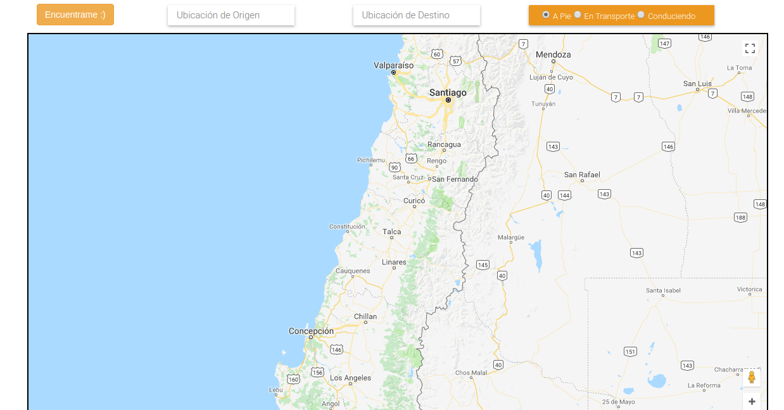
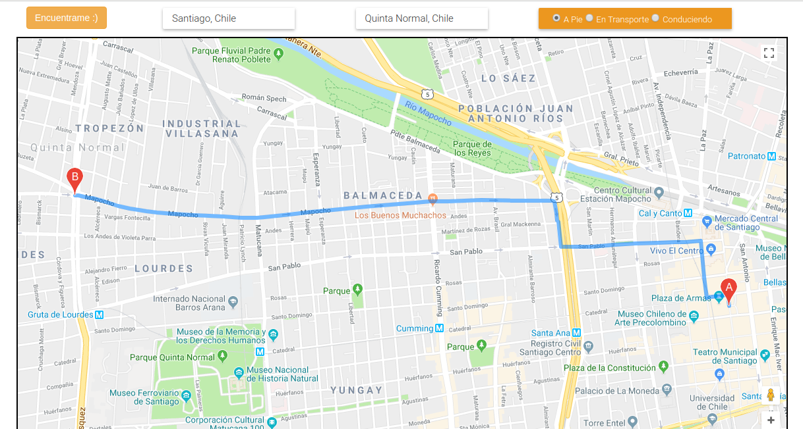

# Encuéntrame

Encuéntrame es una app simple, que cuenta con el servicio de Geolocalización de Google. 

Puedes buscar tu ubicación en tiempo real o bien trazar la ruta a pie, en auto o en transporte público. 

***

* Dependencias de Producción
  - jQuery `~v.3.3.1`
  - Bootstrap `~v.3.3.7`

